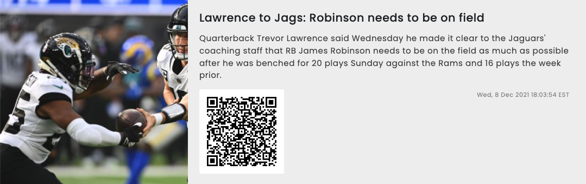
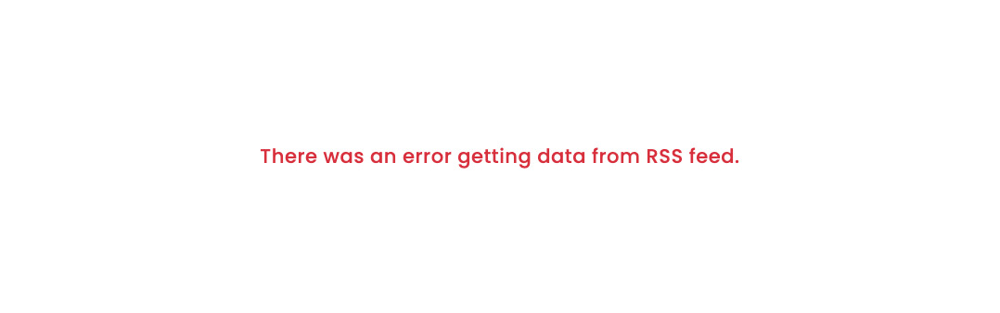

## Rich RSS - React App
Fully customizable plugin to show rich media RSS feeds complete with images and QR codes.

### Note
~~BBC and CNN Links seems to have CORS Issues and will show an error similar tot he error screenshot~~

### Changes

#### 2021-12-30
* Getting RSS from `https://plugin.screenplify.com/scripts/rss/v1/` (Means can parse BBC and CNN also)

### Samples
* More ESPN: https://www.espn.com/espn/news/story?page=rssinfo 
* With Images: https://www.espn.com/espn/rss/nfl/news 
* Without Images: https://www.cnbc.com/id/100003114/device/rss/rss.html
* Without Images: http://rss.cnn.com/rss/edition.rss
* Without Images: http://feeds.bbci.co.uk/news/rss.xml

